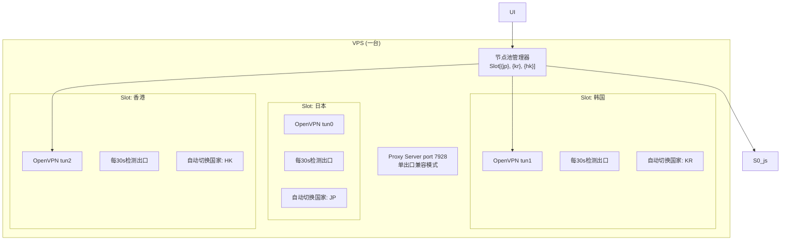
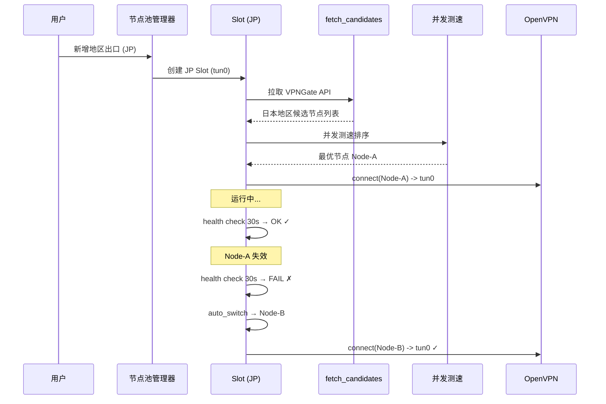

# 多地区节点出口

Feature Name: multi-node-egress
Updated: 2026-08-01

## 描述

一台 VPS 上支持同时维护多个地区（国家）的 VPN 出口。用户在 Web UI 上设定 N 个地区出口（如日本、韩国、香港），每个出口独立自动选取该地区最优 VPNGate 节点，节点失效自动更换，互不干扰。上层应用通过不同的本地端口访问不同地区的出口。

## 架构

核心思路：**每个地区出口是一个独立的 Slot**，内部复用一个已有的 `auto_switch_node / connect_node / background_proxy_checker` 链路，只是把原本全局唯一的那套逻辑变成 per-slot 运行。



每个 Slot 独立运行完整的节点生命周期：



## 组件与接口

### 1. NodePool 管理器 (vpngate_manager.py)

全局 `node_pool: dict[str, Slot]`，key 为 slot id（如 `JP_JP_xxx`）。

每个 Slot 的数据结构：

```python
class Slot:
    slot_id: str
    country: str                     # 用户指定的国家地区（如 日本）
    country_code: str                # 国家代码（如 JP）
    tun_index: int                   # 0-4
    process: subprocess.Popen | None
    state: str                       # connected/connecting/failed/idle
    node_id: str
    node_ip: str
    latency_ms: int
    proxy_ok: bool
    proxy_ip: str
    last_heartbeat: float
```

### 2. Web API

`GET /api/slots` — 获取所有廊口状态，返回：

```json
{
  "slots": [
     {
       "slot_id": "JP_JP_1.2.3.4_443_tcp",
       "country": "日本",
       "country_code": "JP",
       "tun_device": "tun0",
       "state": "connected",
       "node_id": "JP_JP_1.2.3.4_443_tcp",
       "node_ip": "1.2.3.4",
       "latency_ms": 45,
       "proxy_ok": true,
       "proxy_ip": "1.2.3.4"
     }
  ],
  "max_slots": 5
}
```

`POST /api/slot/add` — 添加一个地区出口

```json
{
  "country": "JP",
  "region": "auto"  // "auto" = 自动选取该地区最优节点
}
```

`POST /api/slot/remove` — 移除一个地区出口

```json
{"slot_id": "JP_JP_xxx"}
```

`POST /api/slot/renew` — 强制更新某地点出口节点

```json
{"slot_id": "JP_JP_xxx"}
```

| 端点 | 方法 | 描述 |
|------|------|------|
| `/api/slots` | GET | 获取所有地区出口状态 |
| `/api/slot/add` | POST | 新增一个地区出口 `{"country": "JP"}` |
| `/api/slot/remove` | POST | 移除一个地区出口 `{"slot_id": "..."}` |
| `/api/slot/renew` | POST | 强制更新某地区出口节点 `{"slot_id": "..."}` |

### 3. 现有 API 兼容性

`/api/nodes` 保持不变，返回的 `state` 中新增 slot_summary 字段：

```json
{
  "nodes": [...],
  "state": {...},
  "slot_summary": {...}
}
```

原有 `GET /api/gateway_status` 中每个 Slot 的 OpenVPN 连接也以独立组件形式在 services 列表中显示。

### 4. UI 变更

在新的"多地区出口"面板页面（或嵌入主页），展示以下界面：

- 每个地区出口一排状态卡片（国家国旗图标、连接状态、出口 IP、延迟）
- 下拉选择需要新增的地区出口（含全部可用的国家列表）
- 每个卡片上有"移除""更新"按钮

## 数据模型

### ui_auth.json 扩展

```json
{
  "slot_countries": ["JP", "KR", "HK"]
}
```

`slot_countries` 是持久化的用户地区出口配置列表。

### state.json 扩展

```json
{
  "slot_nodes": {
     "JP": {
        "node_id": "JP_JP_1.2.3.4_443_tcp",
        "connected": true,
        "tun_device": "tun0",
        "latency_ms": 45,
        "proxy_ok": true,
        "proxy_ip": "1.2.3.4"
     },
     "KR": {
        "node_id": "KR_South_Korea_xxx",
        "connected": false,
        "tun_device": "tun1",
        "latency_ms": 0,
        "proxy_ok": false,
        "proxy_ip": "-"
     }
  }
}
```

## 正确性约束

1. **地区唯一性**：同一时刻 node_pool 中不能有 2 个出口属于同一地区
2. **tun index 复用**：每个出口分配一个 tun device，移除后释放
3. **后台线程独立**：每个 slot 的后台维护线程独立运行，不依赖全局锁
4. **兼容单节点**：slot_countries 为空或长度为 1，系统回退到现在的单出口模式
5. **进程隔离**：每个 slot 的 OpenVPN 进程、策略路由表、检测定时器全部隔离

## 错误处理

| 场景 | 行为 |
|------|------|
| 超出 5 个地区上限 | 返回 400 "地区出口上限已满" |
| 重复添加同一地区 | 返回 400 "该地区出口已存在" |
| Slot 节点连接失败 | 单进行自动重新连接+日志 |
| Slot 健康检查失败 | 标记该出口失效，后台启动调试并添加日志 |

## 测试策略

1. **单元测试**：Slot 的创建/销毁/状态转换
2. **集成测试**：启动 3 个地区出口，所有独立运行，节点处于可连接时自动修复
3. **兼容性测试**：启动 1 个地区出口，确认所有现有功能正常
4. **故障注入**：模拟某个地区出口的 VPN 断开，验证自动切换及不影响其他地区出口

## 实施顺序

1. Phase A: 重构核心数据模型 — 将全局单节点变量重构为 Slot 实例
2. Phase B: 适配 auto_switch_node / connect_node / policy_routing 对每个 Slot 独立工作
3. Phase C: 适配后台守护线程（checker / pinger）对每个 Slot 独立检测
4. Phase D: 新增 Web API 端点和前端 UI
5. Phase E: 向后兼容验证测试

## 参考

[^1]: (vpngate_manager.py#L1262) - setup_policy_routing 单节点路由配置
[^2]: (vpngate_manager.py#L1758) - connect_node 单节点连接流程
[^3]: (vpngate_manager.py#L1690) - auto_switch_node 自动切换逻辑
[^4]: (vpngate_manager.py#L5620) - background_proxy_checker 后台检测线程
[^5]: (vpngate_manager.py#L5676) - active_node_pinger 延迟测速线程